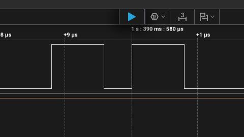
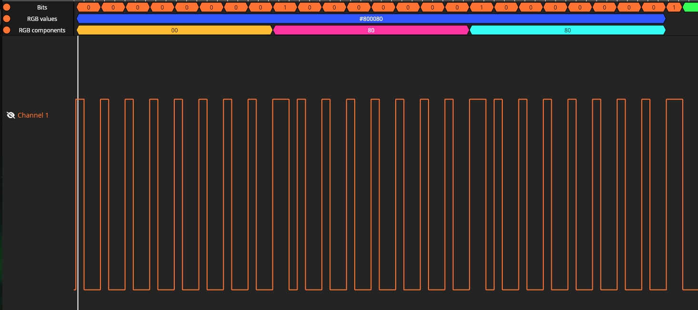
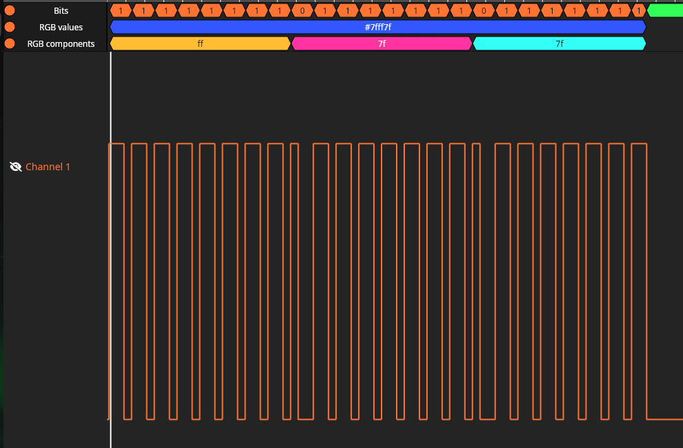

## A hello world program to test the ws2812b LED on the nanoESP-C6

This program uses the RMT (Remote Control Transceiver) peripheral the send out pulses of varying length to the ws2812b.

At the time I am writing this document, the peripheral has a bug that it will send the first pulse twice.

At first I thought it was because of the hardware, but it seems like others have experienced the same thing as well.

- <https://github.com/esp-rs/esp-hal/issues/4622>

- <https://esp32.com/viewtopic.php?t=16088>

### Work around

As you can see here, because the second bit is the duplicated bit, this leads to the whole frame shifted to the right and the last bit of the blue color gets ignored.

So the current solution that I can think of is to remove the MSB of the data frame so we only have 23 bits left, basically shift right the whole frame.

